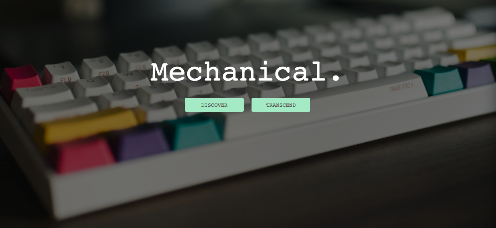

---

## Table of contents

* [Introduction](#introduction)
* [Demo](#demo)
* [Technologies](#technologies)
* [Setup](#setup)
* [Features](#features)
* [Contact](#contact)

---

## Introduction

Malicious keys

<p align="center">Malicious Keys is a mock e-commerce website that features a checkout, shopping cart, and login features, built with JavaScript, React, and Fabric.js.</p>


---

## Technologies

* JavaScript
* React - version 16.13.1
* Redux - version 4.0.5
* Node.js - version 12.11.1
* Express.js - version 4.16.4
* Sequelize - version 5.22.3
* PostgreSQL - version 12.2
* Material-UI - version 4.11.0

---

## Setup

To run this project, install it locally using npm:

```
$ cd ../project_name
$ npm install
$ npm run start-dev
```

---

## Features

* Shopping cart.
* User checkout.
* OAuth google login.

To-do:

* Include user rating for each keyboard
* Add more options to keyboard item (color, amount of keys).

---

## Contact

Created by:
[Linda Eng](https://www.linkedin.com/in/linda-eng/) <br />
[Dewin Pena](https://www.linkedin.com/in/nanpena/) <br />
[Serge Aristes](https://www.linkedin.com/in/claudiasaimbert/)
